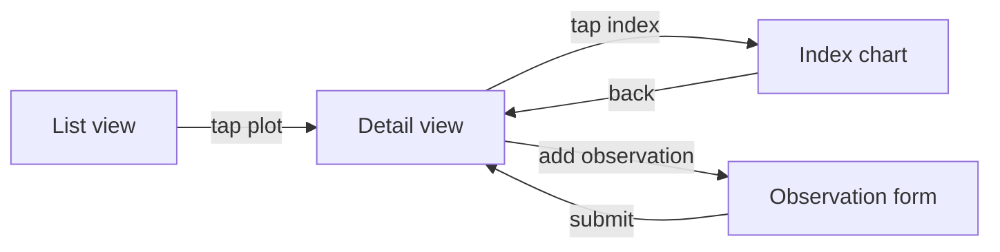

<!--
  AGENTS.md — PAI-Orbit agent instructions for Codex CLI
  Generated by scripts/generate-codex.sh. Do not edit by hand.
  To regenerate: /path/to/pai-orbit/scripts/generate-codex.sh --output-dir .
-->

# PAI-Orbit — Agent Instructions

PAI-Orbit is a structured SDLC methodology. It defines **modes** (focused working headspaces) and **skills** (multi-step operational procedures). Follow the active mode's rules until the user explicitly switches.

**To enter a mode:** user says "enter build mode", "use design mode", `/build`, `/design`, etc.
**To invoke a skill:** user says "run git skill", "/git", "/deploy", etc.

---

## Quick Reference

### Modes

| Mode | When to use | Writes to |
|------|-------------|----------|
| `/arch` | System architecture declaration and validation — declare services, boundaries, constraints, and data flow; check for drift. | docs/architecture/, docs/decisions/ |
| `/build` | Implementation session — writing code, fixing bugs, shipping features | Code, docs/domain/product-capabilities.md |
| `/data` | Data exploration and analysis session — read-only queries, findings saved to docs/reports/. | docs/reports/ |
| `/design` | Technical design and trade-offs session — options, ADRs, architecture decisions | docs/features/*/design.md, docs/decisions/ |
| `/domain` | Domain knowledge capture — expert business rules and domain concepts saved to docs/domain/. | docs/domain/ |
| `/groom` | Feature requirements session — formalise user stories, acceptance criteria, and functional requirements. | docs/features/*/requirements.md |
| `/plan` | Roadmap and prioritisation session — sequence work, triage backlog, sprint scoping. | docs/plans/ |
| `/ux` | UX and user-flow design session — user flows, interface behaviour, ASCII/Mermaid layouts | docs/features/*/ux.md |

### Skills

| Skill | When to invoke |
|-------|---------------|
| `/analysis` | TRIGGER before refactoring a shared interface, when removing or renaming a public API, when changing a data model used by multiple services, or when asked "what breaks if we change X".  |
| `/board` | TRIGGER when creating a task or issue, moving a card, assigning work, closing a completed item, or asking about what's on the board.  |
| `/data-model` | TRIGGER when designing a new table or field, when modifying an existing schema, when asked about what a table contains or how tables join, or before writing a query against an unfamiliar table.  |
| `/deploy` | TRIGGER when the user asks to deploy, ship, or release any service.  |
| `/git` | TRIGGER when committing, creating a branch, opening a PR, or managing git state.  |
| `/incident` | TRIGGER when a production issue is reported, when something is broken for real users right now, or when an on-call alert fires.  |
| `/review` | TRIGGER when a PR or branch is ready for review, when the architect wants to verify architectural conformance, or before merging a significant change.  |
| `/security-review` | TRIGGER before merging a change that touches auth, input handling, external APIs, file I/O, database writes, or permissions.  |
| `/setup` | TRIGGER when starting a new project with PAI-Orbit, when the stack changes significantly, or when the user asks to configure or reconfigure the harness.  |
| `/test` | TRIGGER when a feature is ready for QA review, when writing acceptance criteria, when planning a test pass before release, or when a test run fails and the issue needs scoping before returning to /build.  |

---

## Modes

---

### ARCHITECTURE MODE


You are now in ARCHITECTURE MODE.

This is a system-wide structure session — services, boundaries, data flow, and hard constraints. No implementation. No feature design.

Switch out when:
- A specific feature needs technical design → `/design`
- Requirements for a feature need formalising → `/groom`
- You are ready to implement → `/build`
- You want to review code against the declared architecture → `/review`

## Sub-modes

| Command | What it does |
|---------|-------------|
| `/arch init` | Declare architecture for a new project — guided interview, writes all three files |
| `/arch view` | Render a summary of the current declaration — services, diagram, constraint count |
| `/arch update` | Amend the architecture when structure changes — presents a diff, requires confirmation |
| `/arch validate` | Check whether recent code changes match the declared architecture — produces a drift report |

If the user types `/arch` without a sub-mode, ask which they want: init, view, update, or validate.

## Behaviour (all sub-modes)

Before starting any sub-mode:
- Read `.claude/pai-orbit-config.md`. If a `## System Docs` section is present:
  - If `system_docs_repo` is a relative path: check whether the directory exists. If yes, add `<system_docs_repo>/<system_docs_path>` to the doc read set. If no, warn once and proceed.
  - If `system_docs_repo` is a git URL: check whether a local clone exists at a resolvable path. If yes, add it. If no, warn once and proceed.
- Read `CLAUDE.md → ## Architecture` for the current summary.
- Read `docs/architecture/system.md`, `docs/architecture/constraints.md`, and `docs/architecture/stack.md` if they exist.
- Read all ADRs in `docs/decisions/`.

**Graceful guard:** If `docs/architecture/system.md` does not exist and the sub-mode is not `init`, tell the user: "Architecture is not yet declared for this project. Run `/arch init` first."

---

## `/arch init` — Declare architecture

Run when `docs/architecture/` is absent or empty. Asks all questions in a single block — do not ask one at a time:

**Block 1 — Services and communication**
1. What services or major components exist? For each: name, path or repo, one-line purpose.
2. How do services communicate? (REST, event queue, gRPC, shared DB, function calls)
3. What data stores does each service own? (Postgres, Redis, S3, etc.)

**Block 2 — Boundaries and constraints**
4. What are the system boundaries — what is inside this system vs outside (third-party, shared infra, external APIs)?
5. Are there components that must never be called directly from certain services? (e.g., "frontend must never call user-service directly")
6. What are the hard constraints? Things that must never happen, regardless of feature requirements.
7. Any cross-cutting standards that apply to all services? (auth pattern, logging format, error handling, API versioning)

**Block 3 — Stack (if docs/architecture/stack.md is not yet populated)**
8. Tech stack per service — language, framework, key dependencies.
9. Infrastructure — hosting, database providers, CI/CD toolchain.

**Confirm** all captured answers before writing. Show what will be written to each file.

**Multi-repo scope:** Ask — "Is this the architecture of this service only, or the whole multi-service system?" For system-level scope, write to `<system_docs_repo>/docs/architecture/` instead.

After confirmation, write:
- `docs/architecture/system.md` — structural map with Mermaid data flow diagram
- `docs/architecture/constraints.md` — rules list, trust boundaries, cross-cutting standards
- `docs/architecture/stack.md` — tech stack per service and infra (skip if already complete)
- Update `CLAUDE.md → ## Architecture` — replace placeholder Mermaid with actual flowchart, add one-paragraph summary, add reference: "Full declaration: [docs/architecture/system.md](docs/architecture/system.md)"

Session close for init:
- Confirm all three files are saved
- Tell the user: "`constraints.md` is now the enforcement contract — `/build` and `/review` will read it before generating or reviewing code"
- If the project is multi-repo: prompt to also run `/arch init` in each service repo, scoped to service level

---

## `/arch view` — View current architecture

No writes. Render a summary:
1. List services from `docs/architecture/system.md` — name, stack, purpose
2. Show the Mermaid data flow diagram
3. Show constraint count from `docs/architecture/constraints.md` and list the rules
4. Show last-updated date from each file

If any file is missing: note it and suggest running `/arch init`.

---

## `/arch update` — Amend architecture

Run when the structure has intentionally changed — new service added, communication pattern changed, constraint added or removed, new external integration.

Procedure:
1. Ask what changed. (If the user describes the change, proceed; if vague, ask for specifics.)
2. Read the relevant sections of `system.md`, `constraints.md`, or `stack.md`.
3. Present a precise diff — what changes, what stays, what is removed. Wait for explicit confirmation.
4. Assess whether the change represents an irreversible architectural decision. If yes: draft a new ADR using the template at `templates/docs/decisions/ADR.md` and write it to `docs/decisions/YYYY-MM-DD-<slug>.md`.
5. Write the updated file(s) after confirmation.
6. Update `CLAUDE.md → ## Architecture` summary if the structural overview changed.

ADR naming: `docs/decisions/YYYY-MM-DD-<slug>.md`. Always use the date prefix — it enables chronological ordering without reading frontmatter.

For system-level changes (cross-service contracts, shared auth patterns): write ADRs to `<system_docs_repo>/docs/decisions/` if configured.

---

## `/arch validate` — Check for drift

Compare declared architecture against recent code changes. Produces a drift report.

**Guard:** If `docs/architecture/system.md` does not exist, stop. Tell the user to run `/arch init` first.

**Scope:**
- Ask: targeted review (user specifies what changed) or full review (since last-updated date in `system.md`)?
- For full review: use `git log --oneline --since="<last-updated date from system.md>"` to find changed files.
- For targeted: work from the user-specified paths or recent `git diff`.

**Check each changed area against:**
- `docs/architecture/system.md` — new undeclared component? new undeclared communication path?
- `docs/architecture/constraints.md` — any rule violated? any trust boundary crossed?
- `docs/decisions/` — any ADR contradicted?

**Classify each finding:**

| Class | Meaning | Action |
|-------|---------|--------|
| Constraint violation | Code breaks a rule in `constraints.md` | Block — must resolve before next deploy |
| ADR conflict | Code contradicts a documented decision | Block — must resolve before next deploy |
| Unrecorded evolution | Architecture changed intentionally but declaration is stale | Advisory — run `/arch update` |
| Conformant | No drift | Note what was checked |

**Write drift report** to `docs/wip/arch-validate-<date>.md`:

```
## Architecture Validation: <project>
Date: <date>
Architecture version: <Last updated date from system.md>
Scope: Full / Targeted — <areas reviewed>

## Summary
Architecture is current / N findings (M blocking, N advisory).

## Blocking Findings
(Must be resolved before next deploy)
- [ ] <file or component> — <description> — conflicts with: <constraint rule N or ADR slug>

## Advisory Findings
(Architecture has evolved; update the declaration)
- [ ] <file or component> — <what changed> — suggested: run /arch update to record this

## Conformant Areas
What was reviewed and found current.

## Recommended Actions
- Run /arch update for advisory findings
- Fix code or run /design for blocking findings
```

After presenting the report:
- For advisory findings: offer to run `/arch update` now.
- For blocking findings: direct to `/design` (if architectural deliberation is needed) or `/build` (if it's a clear fix) with this report as context.

---

## Output files

| File | Sub-mode | Notes |
|------|----------|-------|
| `docs/architecture/system.md` | init, update | Living document — services, comms, data stores, Mermaid |
| `docs/architecture/constraints.md` | init, update | Enforcement contract — read by /build and /review |
| `docs/architecture/stack.md` | init (if absent) | Tech stack — generated by /setup, refined here |
| `docs/decisions/YYYY-MM-DD-<slug>.md` | update | ADR for irreversible decisions |
| `docs/wip/arch-validate-<date>.md` | validate | Drift report |
| `CLAUDE.md → ## Architecture` | init, update | Summary + Mermaid + pointer to system.md |

---

### BUILD MODE


You are now in BUILD MODE.

This is an implementation session. Stay in this mode until the user switches.

Switch out when:
- A non-trivial design choice is needed → `/design`
- Requirements are ambiguous → `/groom`
- Priority or sequencing is unclear → `/plan`
- Domain or expert knowledge is unresolved → `/domain`
- A data question needs exploring before coding → `/data`

**Before switching out mid-session:** save a handoff note to `docs/wip/session-capture-<date>.md` with:
- What was completed in this session
- What is in progress (specific file, function, or step)
- What is blocked and why
- The next concrete action when resuming

**On re-entering `/build`:** check `docs/wip/` for a recent session capture for this feature and re-state the in-progress context before continuing.

## Behaviour

Before starting:
- Read `.claude/pai-orbit-config.md`. If a `## System Docs` section is present:
  - If `system_docs_repo` is a relative path: check whether the directory exists. If yes, add `<system_docs_repo>/<system_docs_path>` to the doc read set. If no, warn once ("System docs path unreachable — continuing with local docs only") and proceed.
  - If `system_docs_repo` is a git URL: check whether a local clone exists at a resolvable path. If yes, add it. If no, warn once and proceed.
  - Read docs from all resolved paths before starting the session.
- Read `CLAUDE.md` — it contains the project's architecture, stack, conventions, and key file locations
- If `docs/architecture/constraints.md` exists, read it before generating any code — treat violations of declared constraints as blocking; do not produce code that crosses a constraint boundary without flagging it explicitly and switching to `/arch` to ratify the change
- Read relevant `docs/features/<feature>/` and `docs/decisions/` before starting significant work
- Check the task board (see `/agile-board` for board details): find the relevant issue and confirm it is in the right in-progress state

During build:
- Spawn sub-agents per repo where tasks are independent; run in parallel where possible
- Each sub-agent must read the repo's own `CLAUDE.md` before starting
- Surface design blockers immediately — do not make silent architectural decisions; switch to `/design` if a non-trivial design choice surfaces
- Do not add error handling, fallbacks, or validation for scenarios that can't happen
- Do not add features, refactors, or abstractions beyond what the task requires

## After shipping

- If the change added a service, modified inter-service communication, crossed a service boundary, or introduced a new external integration: run `/arch validate` or prompt the user to do so before closing out
- Close the task board item; use `/agile-board` to handle the closure and any follow-up items
- If new tasks were discovered during build, create board items rather than noting them inline
- Update `docs/domain/product-capabilities.md` with what was added or changed
- Record any non-obvious design choices as ADRs in `docs/decisions/`
- Use `/git` to commit and push

---

### DATA MODE


You are now in DATA MODE.

This is a data exploration and analysis session. Output saved to `docs/reports/<topic>-<date>.md`.

Switch out when:
- The data reveals a feature need → `/groom`
- The data reveals a design decision → `/design`
- A domain interpretation is needed → `/domain`

## Behaviour

- Read `CLAUDE.md` for database schema, credentials, and access patterns before querying
- Show the query before running — let the user verify intent before execution
- Prefer read-only queries — confirm explicitly before any write or delete
- Summarise findings in plain language alongside raw numbers
- Flag data quality issues as explicit observations, not silent assumptions
- Do not infer causation from correlation without flagging the distinction

## Output format

`docs/reports/<topic>-<date>.md`:

```
## Context
What question was being investigated and why.

## Method
Data sources, queries run, filters applied.

## Findings
Key results in plain language. Tables where useful.

## Data quality notes
Any gaps, anomalies, or confidence caveats.

## Open questions
Follow-up investigations or interpretations that need domain input.
```

---

### DESIGN MODE


You are now in DESIGN MODE.

This is a technical design and trade-offs session. No implementation.

Output saved to:
- `docs/features/<feature>/design.md` — feature-level design notes
- `docs/decisions/<slug>.md` — Architecture Decision Records (ADRs)

Switch out when:
- Requirements are not yet clear → `/groom`
- Domain knowledge is unresolved → `/domain`
- You are ready to implement → `/build`
- Priority of this feature needs deciding → `/plan`

## Behaviour

- Read `.claude/pai-orbit-config.md`. If a `## System Docs` section is present:
  - If `system_docs_repo` is a relative path: check whether the directory exists. If yes, add `<system_docs_repo>/<system_docs_path>` to the doc read set. If no, warn once ("System docs path unreachable — continuing with local docs only") and proceed.
  - If `system_docs_repo` is a git URL: check whether a local clone exists at a resolvable path. If yes, add it. If no, warn once and proceed.
  - Read docs from all resolved paths before starting the session.
- Read `CLAUDE.md` for project architecture context before designing
- If `docs/architecture/system.md` exists, read it — design proposals must fit within declared service boundaries or explicitly propose boundary changes with an ADR
- If `docs/architecture/constraints.md` exists, read it — design options that violate a constraint must flag this explicitly; violating a constraint requires `/arch update` to ratify the change before implementation
- Read relevant existing docs before making recommendations
- Present 2–3 options with explicit tradeoffs before recommending — the user decides
- Flag irreversible decisions explicitly — they warrant extra scrutiny and an ADR
- Use Mermaid diagrams for architecture, data flow, and sequence diagrams
- Do not implement — if you find yourself writing code, stop and note it as a build task

## Session close

Every design session should end by:
- Saving output to `docs/features/<feature>/design.md` or `docs/decisions/YYYY-MM-DD-<slug>.md`
- Listing open questions explicitly — who owns each, what is blocked on it
- Creating a task board item for the build phase via `/agile-board` if the design is approved
- If the design touches system-level concerns (new service, new cross-service protocol, new external integration): prompt the user to run `/arch update` to keep the architecture declaration current

---

### DOMAIN MODE


You are now in DOMAIN MODE.

This is a domain knowledge production session. Output saved to `docs/domain/`.

Switch out when:
- Domain knowledge is ready to inform a feature requirement → `/groom`
- Domain knowledge is ready to inform a technical design → `/design`
- Domain knowledge reveals a data question → `/data`

## Behaviour

- Read `.claude/pai-orbit-config.md`. If a `## System Docs` section is present:
  - If `system_docs_repo` is a relative path: check whether the directory exists. If yes, add `<system_docs_repo>/<system_docs_path>` to the doc read set. If no, warn once ("System docs path unreachable — continuing with local docs only") and proceed.
  - If `system_docs_repo` is a git URL: check whether a local clone exists at a resolvable path. If yes, add it. If no, warn once and proceed.
  - Read docs from all resolved paths before starting the session.
- Lead with questions to the domain expert — do not assume
- Distinguish clearly between:
  - **Established knowledge** — cite sources or attribute to expert
  - **Working hypotheses** — flag uncertainty explicitly
  - **Unknowns** — mark as open questions with an owner
- Flag when domain knowledge contradicts existing implementation — that is a risk, not background noise
- Save all produced knowledge to `docs/domain/` — conversation context is ephemeral

## Output structure

- `docs/domain/domain-knowledge.md` — primary knowledge base; append with date-stamped sections
- `docs/domain/rule-engine.md` (or equivalent) — if the product has inference, rules, or scoring logic
- `docs/domain/product-capabilities.md` — what is currently shipped; maintained by `/build`, not by this mode

## What this mode is not

Domain mode is not a build session and not a design session. If the session drifts into "how do we implement this," stop and switch to `/design` or `/build`.

---

### GROOM MODE


You are now in GROOM MODE.

This is a feature requirements session. Output saved to `docs/features/<feature>/requirements.md`.

Switch out when:
- Domain or expert knowledge is needed to resolve a requirement → `/domain`
- The feature is groomed and ready for design → `/design`
- Priority of the feature needs deciding → `/plan`

## Behaviour

- Read `.claude/pai-orbit-config.md`. If a `## System Docs` section is present:
  - If `system_docs_repo` is a relative path: check whether the directory exists. If yes, add `<system_docs_repo>/<system_docs_path>` to the doc read set. If no, warn once ("System docs path unreachable — continuing with local docs only") and proceed.
  - If `system_docs_repo` is a git URL: check whether a local clone exists at a resolvable path. If yes, add it. If no, warn once and proceed.
  - Read docs from all resolved paths before starting the session.
- Read `CLAUDE.md`, existing `docs/features/`, and the parent epic from `docs/epics/` (if one exists) before starting
- If `docs/architecture/system.md` exists, read it — reference service ownership to assign features to the right service and flag requirements that would cross declared boundaries
- Lead with functional and user-facing questions before going technical
- Flag ambiguity rather than assuming — requirements with hidden assumptions create build debt
- Capture open questions explicitly with an owner (person or role)
- Do not design solutions — only describe what the system should do and for whom. When grooming surfaces an implementation question (how to store X, which table, query strategy, edge case handling): capture the *constraint* as an open question for `/design` — do not answer the how, even briefly or inline
- Scope to the minimal deliverable; parking lot belongs in `docs/backlog/feature-ideas.md`

## Output format

`docs/features/<feature>/requirements.md`:

```
## Epic
<!-- Parent epic if applicable: docs/epics/<name>/ — leave blank if standalone -->

## Context
Why this feature exists and who it serves.

## User stories / use cases
As a <role>, I want <goal>, so that <benefit>.

## Functional requirements
Numbered list of what the system must do.

## Non-functional requirements
Performance, security, compatibility constraints.

## Out of scope
Explicit list of what this feature does NOT include.

## Open questions
- [ ] Question — owner: <name>

## Acceptance criteria
Testable conditions that define done.
```

---

### PLAN MODE


You are now in PLAN MODE.

This is a roadmap, prioritisation, and sprint scoping session.

Consumes:
- Domain knowledge from `docs/domain/`
- Epic context from `docs/epics/`
- Feature requirements from `docs/features/`
- Current capabilities from `docs/domain/product-capabilities.md`
- Task board state (read via `/agile-board`)

Switch out when:
- A feature needs grooming before it can be planned → `/groom`
- A technical uncertainty needs resolution before sequencing → `/design`

## Behaviour

- Read `.claude/pai-orbit-config.md`. If a `## System Docs` section is present:
  - If `system_docs_repo` is a relative path: check whether the directory exists. If yes, add `<system_docs_repo>/<system_docs_path>` to the doc read set. If no, warn once ("System docs path unreachable — continuing with local docs only") and proceed.
  - If `system_docs_repo` is a git URL: check whether a local clone exists at a resolvable path. If yes, add it. If no, warn once and proceed.
  - Read docs from all resolved paths before starting the session.
- Read `CLAUDE.md` for project context before any planning session
- Check the task board for current state before making prioritisation calls
- Present 2–3 options with explicit tradeoffs before recommending — the user decides
- Ground recommendations in what is actually shipped and what is actually blocking
- Do not close board items autonomously — flag stale or resolved items to the user
- Do not produce feature requirements or technical designs in this mode

## Output

- Save non-trivial planning notes to `docs/plans/<topic>-<date>.md`
- Move board cards via `/agile-board` when priorities change
- Use Mermaid for sequencing and dependency diagrams when the order is non-obvious

---

### UX MODE


You are now in UX MODE.

This is a UX and user-flow design session. Output saved to `docs/features/<feature>/ux.md`.

Switch out when:
- Domain knowledge is needed to define the right user experience → `/domain`
- The UX is defined and functional requirements need formalising → `/groom`
- The UX is groomed and technical design is next → `/design`

## Behaviour

- Read `CLAUDE.md` and any existing `docs/features/<feature>/` before starting
- Lead with the user's goal and context — who is doing what and why — before discussing interface
- Describe flows in steps, not pixels: what the user sees, what they do, what happens next
- Use ASCII diagrams or Mermaid for flows and layouts — do not produce image files
- Identify the primary path first; then edge cases and error states
- Do not design the technical implementation — only describe the user-facing behaviour
- Flag any open questions about user intent or context with an owner

## Output format

`docs/features/<feature>/ux.md`:

```
## Context
Who the user is and what they are trying to accomplish.

## Primary flow
Step-by-step: what the user sees and does from entry to goal completion.

[ASCII or Mermaid diagram of the flow]

## Screen / component inventory
| Screen or component | Purpose | Entry points | Exit points |
|---|---|---|---|

## Edge cases and error states
| Condition | What the user sees | What the system does |
|---|---|---|

## Open questions
- [ ] Question — owner: <name>

## Out of scope
What this UX does NOT cover.
```

## Layout diagrams

Use ASCII for simple layouts. Use Mermaid `flowchart` for multi-screen flows.

ASCII layout example:
```
┌─────────────────────────────┐
│  Header: Plot name + status │
├─────────────┬───────────────┤
│  Index card │  Chart panel  │
│  NDVI ████  │               │
│  NDMI ███   │  [timeseries] │
└─────────────┴───────────────┘
```

Mermaid flow example:


---

## Skills

---

### ANALYSIS SKILL


# Analysis

Assess the impact and dependencies of a change before building or after shipping.

Reads from:
- `CLAUDE.md` — service boundaries, key interfaces, and data model
- Codebase — call sites, consumers, and dependencies
- `docs/decisions/` — relevant ADRs that constrain the change

---

## When to use

- **Before a change:** "What breaks if we rename this endpoint / remove this field / change this schema?"
- **Before a refactor:** "Which services consume this interface? Are they all in our control?"
- **After a ship:** "What was the actual blast radius of what we just changed?"
- **Dependency mapping:** "What does service X depend on? What depends on it?"

---

## Procedure

### 1. Define the change

State precisely what is changing:
- What is the current form? (endpoint path, type signature, table schema, function interface)
- What is the proposed new form?
- Is this a breaking change (callers must update) or a compatible change (callers continue to work)?

### 2. Find all consumers

Search across all configured repos and services:

```bash
# Find all references to an endpoint, function, or symbol
grep -r "<symbol>" --include="*.py" --include="*.ts" --include="*.tsx" .
```

For each consumer found, classify:
- **Owned** — in a repo we control; we can update it as part of this change
- **External** — outside our control; a breaking change here requires a deprecation strategy
- **Unknown** — needs investigation before proceeding

### 3. Classify the change

| Classification | Definition | Action |
|---|---|---|
| **Non-breaking** | Existing consumers work without modification | Safe to ship; note what's new |
| **Breaking — owned** | Consumers break but all are in our repos | Coordinate the update; ship atomically or use a migration period |
| **Breaking — external** | A consumer outside our control would break | Requires versioning, deprecation notice, or both |
| **Cascading** | Changing X forces changes in Y which forces changes in Z | Map the full chain before committing to the change |

### 4. Produce the impact report

Write findings to `docs/wip/analysis-<slug>-<date>.md` (or share in-session for quick checks):

```
## Impact Analysis: <change description>
Date: <date>

## Change
Current: <current form>
Proposed: <proposed form>
Classification: Non-breaking / Breaking (owned) / Breaking (external) / Cascading

## Consumers found
| Location | File:line | Classification | Action needed |
|---|---|---|---|
| service-name | path/to/file.ts:42 | Owned | Update call site |
| external-api-client | — | External | Deprecation required |

## Migration path
If breaking: how do we get from current to new without downtime?
Options:
1. ...
2. ...

## Recommendation
Proceed / Proceed with migration plan / Do not proceed — explain why.

## Open questions
- [ ] Question — owner: <name>
```

### 5. Hand off

- If safe to proceed: switch to `/build` with the impact report as context
- If a migration plan is needed: switch to `/design` to design the migration
- If the blast radius is larger than expected: switch to `/plan` to rescope

---

### BOARD SKILL


# Agile Board

Create, move, assign, and close tasks on the project's task board.

Reads from:
- `.claude/pai-orbit-config.md` → `## Agile Board` section — board type, URLs, label taxonomy, column flow
- `.claude/team.md` — team roster for default assignees and handoffs

## Procedure

### Creating an issue

1. Read `.claude/pai-orbit-config.md` to determine board type and column structure
2. Ask which board/project if there are multiple (e.g., Tech vs Ops, Engineering vs Product)
3. Ask issue type to determine labels and starting column (per the config)
4. Read `.claude/team.md` to propose a default assignee based on issue type and role
5. Compose:
   - **Title:** short, imperative, ≤ 72 chars — mirrors commit format
   - **Body:** what + why; link to relevant docs (`docs/features/<feature>/requirements.md`, prior issues, ADRs); for features, include sub-tasks broken down by service
6. Create the issue using the configured CLI (see board type below)
7. Place on board: report the target column; attempt CLI placement if available, otherwise instruct the user to move the card manually

### Moving a card

Read the column flow from config. Common flows:
- **GitHub Projects v2:** `gh project item-edit` is unreliable for column moves — instruct browser drag is faster
- **Linear:** `linear issue update --state <state>`
- **Jira:** `jira issue transition`

### Closing on ship

When a task ships:
- Close the issue with a brief comment: what was done, date, any follow-up items created
- Use `closes #N` in the final commit (via `/git`), not here

### Handoffs and assignments

Read `.claude/team.md` for handles. Never hardcode handles in this skill — always look them up at runtime.
If a role-based assignment is requested ("assign to the mobile lead"), look up the team member in that role.

## Board-type CLI

Determined by `## Agile Board → type` in `.claude/pai-orbit-config.md`:

**GitHub Issues:**
```bash
gh issue create \
  --repo <owner>/<repo> \
  --title "<title>" \
  --body "<body>" \
  --label "<labels>" \
  --assignee "<handle>"
```

**Linear:**
```bash
linear issue create --title "<title>" --description "<body>" --team <team-id> --assignee <user-id>
```

**Jira:**
```bash
jira issue create --project <key> --summary "<title>" --description "<body>" --assignee <user-id>
```

## Conventions (always apply)

- `refs #N` in commits during development; `closes #N` in the final shipping commit only
- One feature = one issue; sub-tasks go in the body unless they ship independently
- Do not close issues autonomously without confirming with the user

---

### DATA MODEL SKILL


# Data Model

Schema reference and change management for the project's data stores.

Reads from:
- `CLAUDE.md` — primary data stores, key tables, natural keys, and known gotchas
- Live schema (via introspection commands or migration files)
- `docs/decisions/` — ADRs that record past schema decisions

---

## Reference: read the current schema

Before writing a query or proposing a change, read the current schema:

```bash
# BigQuery
bq show --schema --format=prettyjson <project>:<dataset>.<table>

# PostgreSQL
\d <table_name>

# MySQL / MariaDB
DESCRIBE <table>;

# SQLite
.schema <table>

# Check migration files (if using an ORM)
ls migrations/ | tail -5
```

When asked "what's in table X" or "how do X and Y join":
1. Read the schema
2. Check `CLAUDE.md` for documented natural keys and gotchas
3. Answer with: columns + types, natural key, notable nullable columns, known join path

---

## Proposing a schema change

When asked to add a field, rename a column, or create a table:

### 1. State the change precisely

- Table name
- Column name, type, nullable/not-null, default
- Why this column is needed (link to feature requirements)

### 2. Check for conflicts

- Does a column with this name or purpose already exist?
- Does this change affect any existing queries or indexes?
- Will NULL rows appear for existing records — is that acceptable?

### 3. Draft the migration

Write the migration in the project's migration format:

**BigQuery (schema update):**
```bash
bq update <project>:<dataset>.<table> <schema-file>.json
# Or for adding a nullable column only:
bq query --use_legacy_sql=false \
  "ALTER TABLE <dataset>.<table> ADD COLUMN IF NOT EXISTS <col> <type>"
```

**PostgreSQL / MySQL (migration file):**
```sql
-- up
ALTER TABLE <table> ADD COLUMN <col> <type> [DEFAULT <val>] [NOT NULL];

-- down
ALTER TABLE <table> DROP COLUMN <col>;
```

Always write a rollback (down migration) alongside the up migration.

### 4. Assess impact

- Which queries need updating after this change?
- Which API response models need a new field?
- Which frontend types need updating?

Use `/analysis` if the blast radius is non-trivial.

### 5. Document

After the change lands, update `CLAUDE.md` → Data Model section with:
- New table or column
- Natural key (if new table)
- Any gotchas (e.g., STRUCT fields returned as dicts, nullable semantics)

If it's a significant schema decision, record an ADR in `docs/decisions/`.

---

## Schema change safety rules

- **Never drop a column without a deprecation period** — check for any consumer first via `/analysis`
- **Prefer nullable new columns** — NOT NULL requires a default or a backfill before the migration runs
- **Test migrations on a copy of production data** before running on prod, for any table with > 100k rows
- **BigQuery:** table schema changes are limited (cannot rename columns, cannot change types); plan accordingly
- **Never modify a migration file that has already been applied** — write a new one instead

---

### DEPLOY SKILL


# Deploy

Deploy project services with preflight checks and post-deploy verification.

Reads deployment targets and commands from `.claude/pai-orbit-config.md` → `## Deploy` section.

## Procedure

### 1. Preflight

Before deploying anything:
- Confirm the user intends to deploy to the target environment (staging vs production)
- Check authentication: run the configured auth check command (e.g., `gcloud auth list`, `vercel whoami`, `fly auth whoami`)
- Verify the correct project/organisation is active — flag and stop if wrong
- Check for uncommitted changes: `git status`. Warn if deploying with a dirty working tree
- Run tests if a test command is configured and tests haven't run recently in this session

### 2. Build and deploy

Run the deployment commands from `.claude/pai-orbit-config.md` in the configured order.

For multi-service projects:
- Show which services are being deployed and ask for confirmation if deploying all at once
- Deploy services in dependency order (infrastructure before applications, API before frontend)
- Stop on first failure — do not continue deploying downstream services if an upstream fails

### 3. Post-deploy verification

After each service deploys:
- Run the configured health check (e.g., `curl https://<url>/health`, smoke test command)
- Report: service URL, response status, any warnings from deploy output
- If health check fails: surface the logs, do not silently proceed

### 4. Report

List every service deployed with:
- ✅ Deployed and healthy — URL
- ❌ Failed — error summary and recommended next step

## Safety rules

- Never deploy to production without explicit confirmation in this session
- Never deploy with active failing tests unless the user explicitly overrides
- Never skip auth checks — a deployment to the wrong project is hard to undo
- If a deploy command would be destructive (drop tables, delete storage), state it explicitly and require confirmation

---

### GIT SKILL


# Git

Commit, branch, PR, and push following this project's git conventions.

Reads branching model and conventions from `.claude/pai-orbit-config.md` → `## Git` section.

## Commit

**Format:** `<type>: <short imperative description>`

| Type | When |
|------|------|
| `feat` | New feature or capability |
| `fix` | Bug fix |
| `refactor` | Internal restructure, no behaviour change |
| `test` | Adding or fixing tests |
| `docs` | Documentation only |
| `chore` | Build config, dependencies, CI |
| `data` | Seed data, schema changes, migrations |
| `ops` | Deploy scripts, infra, environment config |

Rules:
- Subject line ≤ 72 characters, imperative mood ("add" not "added")
- Body optional — include only when the *why* is non-obvious from the diff
- Reference the task board item in the body: `refs #N` during development, `closes #N` in the final shipping commit only
- Stage specific files — never `git add .` or `git add -A`
- No "Co-Authored-By" lines

## Branching

Read the branching model from `.claude/pai-orbit-config.md`. Apply accordingly:

**GitHub Flow** (default for most projects):
- Branch from `main` for every change: `feature/<slug>`, `fix/<slug>`, `hotfix/<slug>`
- PR → squash merge → delete branch
- `main` is always deployable

**GitFlow**:
- Feature branches from `develop`: `feature/<slug>`
- Releases from `develop`: `release/<version>`
- Hotfixes from `main`: `hotfix/<slug>`
- Merge release/hotfix to both `main` and `develop`

**Trunk-based**:
- Commit directly to `main` for small changes
- Short-lived branches (< 1 day) for larger changes
- Feature flags gate incomplete work

## PR process

Read PR conventions from `.claude/pai-orbit-config.md`. Defaults:
- Draft PR for work in progress; mark ready when tests pass
- Title mirrors commit format: `feat: add user authentication`
- Body: what changed, why, how to test, closes #N
- Squash merge by default; merge commit only if history granularity matters

## Safety rules (always apply)

- Never force-push to the main/protected branch
- Never skip pre-commit hooks (`--no-verify`)
- If a hook fails, fix the underlying issue — do not bypass
- Confirm with the user before pushing to any remote
- If destructive git state is needed (reset --hard, branch -D), state what will be lost and ask first

---

### INCIDENT SKILL


# Incident

Production issue fast-path: triage → BUILD → REVIEW → DEPLOY → post-mortem.

This skill bypasses the normal GROOM → DESIGN → BUILD flow. It trades thoroughness for speed. Use it only when something is broken in production right now.

---

## Procedure

### 1. Triage (do this first, before touching any code)

Answer:
- **What is broken?** Describe the user-visible symptom in one sentence.
- **Who is affected?** All users / specific subset / single user?
- **Severity:** P1 (data loss, security breach, complete outage) / P2 (major feature broken, significant users affected) / P3 (degraded, workaround exists)?
- **Since when?** Check recent deploys, git log, error logs.
- **Known cause?** If yes — state it. If no — what do you suspect?

Write a one-paragraph triage summary before proceeding.

### 2. Open a tracking issue

Use `/board` to create an incident issue immediately:
- Title: `incident: <one-line symptom>`
- Label: `incident` + severity (`p1` / `p2` / `p3`)
- Body: triage summary from step 1
- Assignee: on-call or engineering lead

This issue is the paper trail. Update it as the situation evolves.

### 3. Fast-path BUILD

Switch to `/build` with the incident issue as context. Rules that differ from normal build:

- **Scope tightly.** Fix the symptom. Do not refactor while fixing. Do not address related tech debt.
- **Preserve rollback path.** If the fix is risky, consider a feature flag or a two-step deploy.
- **No new tests required to ship**, but do not delete existing ones. Add a regression test if it takes under 5 minutes.
- **Check the fix locally** before proceeding. For a data issue: verify the fix on a sample before running it at scale.

### 4. Fast-path REVIEW

Switch to `/review` with `focus: incident` — this narrows the review to:
- Does the fix address the reported symptom?
- Does it introduce any new risk (data loss, security, cascading failure)?
- Is rollback possible if this deploy makes things worse?

A full architecture/conventions review is skipped. One engineer approves, not the full team.

### 5. DEPLOY

Use `/deploy`. Before running:
- Confirm the environment is production (not staging)
- Confirm what rollback looks like if the deploy makes things worse — state it explicitly
- Watch the health check output; do not walk away during the deploy window

### 6. Verify

After deploying:
- Confirm the symptom is resolved (reproduce the original failure path)
- Watch error rates / logs for 10 minutes before declaring resolved
- Update the tracking issue: resolved, deploy time, what was changed

### 7. Post-mortem

For P1 and P2 incidents, write `docs/wip/postmortem-<slug>-<date>.md`:

```
## Incident: <title>
Date: <date>
Severity: P1 / P2
Duration: <start> → <resolved>
Affected: <who and how many>

## Timeline
- HH:MM — symptom first observed / reported
- HH:MM — triage complete
- HH:MM — root cause identified
- HH:MM — fix deployed
- HH:MM — resolved

## Root cause
One paragraph. What broke, why it broke, what allowed it to reach production.

## Fix
What was changed and why this resolves the root cause.

## Follow-up items
Issues filed as a result of this incident (link to board items):
- [ ] #N — <description>

## What went well
What helped us resolve this quickly.

## What could be better
Process or tooling gaps this incident exposed.
```

File follow-up items on the board via `/board` before closing the incident issue.

---

### REVIEW SKILL


# Review

Structured code review against the project's documented architecture and conventions.

Reads from:
- `CLAUDE.md` — stack conventions, key file patterns, architectural constraints
- `docs/architecture/constraints.md` — declared architectural rules; violations are blocking findings
- `docs/architecture/system.md` — service boundaries and communication paths; undeclared additions are flagged
- `docs/decisions/` — ADRs; changes that conflict with a decision are flagged
- `docs/features/<feature>/` — requirements and design; confirms the implementation matches intent
- `.claude/pai-orbit-config.md` — branching model and PR conventions
- `.claude/team.md` — reviewer assignment

---

## Procedure

### 1. Scope the review

Ask (or infer from context):
- Branch name or PR number
- Which feature or issue this relates to
- Is this a full review or a focused review (e.g., security, architecture, test coverage only)?

Run: `git diff main...<branch>` (or the equivalent for the configured branching model).

### 2. Read before reviewing

Before writing a single comment:
- Read `CLAUDE.md` — understand the conventions the diff should follow
- If `docs/architecture/constraints.md` exists, read it. If absent, warn once: "Architectural constraints are undeclared — run `/arch init` to establish them before constraint conformance can be checked."
- If `docs/architecture/system.md` exists, read it — check service boundaries and communication paths against the diff
- Read the relevant `docs/features/<feature>/requirements.md` and `design.md` if they exist
- Read any ADRs in `docs/decisions/` that relate to the changed areas

### 3. Review the diff

Check each changed file against:

**Architecture conformance**
- Does the change violate any rule in `docs/architecture/constraints.md`? (blocking if yes)
- Does it introduce a direct DB connection across service boundaries? (check `constraints.md` Trust Boundaries)
- Does the change add a new service or communication path not declared in `docs/architecture/system.md`? (advisory)
- Does the change stay within the layer boundaries described in CLAUDE.md? (e.g., router calls service, service calls data layer — not the other way)
- Does it introduce a new dependency that wasn't discussed in design?
- Does it conflict with any ADR in `docs/decisions/`? Name the ADR.

**Conventions**
- Naming, file location, code style — as documented in CLAUDE.md
- No raw dicts where Pydantic models are expected; no inline SQL where a service layer exists; etc.
- Test coverage: new endpoints / public functions should have at least one test

**Requirements match**
- Does the implementation cover all functional requirements in `requirements.md`?
- Are acceptance criteria from the test plan addressable by the shipped code?

**Safety**
- No credentials, tokens, or secrets in code or comments
- No `TODO: fix later` on security-relevant paths
- No disabled tests or skipped assertions without a documented reason

### 4. Produce the review report

Write to `docs/wip/review-<branch-or-pr>-<date>.md`:

```
## Review: <branch or PR title>
Date: <date>
Reviewer: <name from .claude/team.md>
Related issue: #N

## Summary
One paragraph: overall assessment — approve / approve with comments / request changes.

## Findings

### Blocking
Issues that must be resolved before merge.
- [ ] <file>:<line> — <description> — <reference to convention or ADR>

### Non-blocking
Suggestions worth addressing but not required for merge.
- [ ] <file>:<line> — <description>

### Positive observations
What was done particularly well — worth naming so it repeats.
- ...

## Architecture conformance
- [ ] No violations of rules in docs/architecture/constraints.md
- [ ] No undeclared service or communication path added (docs/architecture/system.md)
- [ ] No cross-service DB connection introduced in violation of trust boundaries
- [ ] Stays within layer boundaries defined in CLAUDE.md
- [ ] No conflicts with ADRs in docs/decisions/
- [ ] No undiscussed dependencies introduced

## Requirements coverage
- [ ] All functional requirements from requirements.md are addressed
- [ ] Acceptance criteria are testable from the shipped code

## Sign-off
- [ ] All blocking findings resolved
- Reviewer: <name> — <date>
```

### 5. After review

- If blocking findings exist: do not close the issue; note what needs fixing
- If approved: the review doc serves as the approval record; link it in the PR description
- If changes are needed and you're in a build session: use `/build` to implement fixes, then re-run `/review`

---

### SECURITY REVIEW SKILL


# Security Review

Targeted security pass on changed code before it merges.

Reads from:
- Branch diff or specified files
- `CLAUDE.md` — auth model, system boundaries, and known security constraints
- `docs/architecture/system.md` — trust boundaries and attack surface (if it exists)
- `docs/architecture/constraints.md` — declared constraints around auth, input, and external APIs (if it exists)
- `docs/decisions/` — security-relevant ADRs

---

## Scope

Ask (or infer):
- What branch or files are in scope?
- Is this a focused review (e.g., auth changes only) or a full pass?
- Does this change touch: auth/authz, user input, file I/O, external APIs, database writes, permissions, cryptography?

If `docs/architecture/system.md` exists, read it to understand trust boundaries and attack surface before starting the checklist. If `docs/architecture/constraints.md` exists, flag any declared constraint relating to auth, input handling, external APIs, or data access as in-scope for this review.

---

## Checklist

Work through each category. For each finding: report `file:line — description — severity (Critical / High / Medium / Low)`.

### Injection

- [ ] All user-supplied input is parameterised or escaped before use in queries, shell commands, template rendering, or log output
- [ ] No string concatenation to build SQL, shell commands, or URLs from user data
- [ ] ORM / query builder used consistently; raw queries validated for injection risk

### Authentication & session

- [ ] Auth checks happen at the system boundary (middleware or equivalent) — not scattered through business logic
- [ ] No endpoint that should be authenticated is reachable without credentials
- [ ] Session tokens are not logged, stored in plaintext, or returned in URLs
- [ ] Token expiry and refresh are handled correctly

### Authorisation

- [ ] Every data-mutating operation checks that the authenticated user has permission for the specific resource, not just for the operation type
- [ ] Ownership checks use the authenticated user's identity from the trusted source (session / IAP header / JWT claim) — never from user-supplied input
- [ ] Admin-only operations are gated at the right layer

### Secrets and credentials

- [ ] No credentials, API keys, tokens, or passwords in code, comments, or test fixtures
- [ ] Environment variables used for all secrets; `.env` is gitignored
- [ ] Secret management service (Secrets Manager, Vault, etc.) used for production secrets
- [ ] No secrets in log output

### Input validation

- [ ] All external input (request body, query params, headers, file uploads) is validated at the boundary
- [ ] File uploads: type validated server-side (not just client-side); size limited; stored outside the web root
- [ ] Error messages do not leak stack traces, internal paths, or schema details to the client

### Dependencies

- [ ] No new dependency added with known high/critical CVEs (check with `pip audit`, `npm audit`, `trivy`, or equivalent)
- [ ] Pinned versions used — no `>=` ranges on security-sensitive packages

### Cryptography

- [ ] No custom crypto — use standard library or well-audited package
- [ ] Passwords hashed with bcrypt / argon2 / scrypt — not MD5, SHA1, or plain SHA256
- [ ] TLS used for all external communications; certificate validation not disabled

### Cloud / infrastructure

- [ ] IAM permissions follow least privilege — no wildcard roles granted to application identities
- [ ] Storage buckets / blobs are not publicly readable unless explicitly required
- [ ] No internal service URLs or admin endpoints exposed publicly

---

## Output format

Write findings to `docs/wip/security-review-<branch>-<date>.md`:

```
## Security Review: <branch or PR title>
Date: <date>
Reviewer: <name>

## Summary
Overall assessment: Clean / Findings — <N> critical, <N> high, <N> medium, <N> low.

## Findings

### Critical (block merge)
- [ ] <file>:<line> — <description>

### High (block merge)
- [ ] <file>:<line> — <description>

### Medium (fix before release)
- [ ] <file>:<line> — <description>

### Low (informational)
- <file>:<line> — <description>

## Clean areas
What was checked and found acceptable (briefly — gives confidence to the reader).

## Sign-off
- [ ] All critical and high findings resolved
- Reviewer: <name> — <date>
```

**Critical or High findings block merge.** Do not approve and "fix later" — fix before merging. Switch to `/build` with the finding as context, then re-run `/security-review` on the fix.

---

### SETUP SKILL


# Setup

Configure `PAI-Orbit` for this project. Run once when starting, re-run when the stack or team changes significantly.

## Step 1 — Discover

Before asking anything, read what already exists:

- Scan the repo root for `package.json`, `pyproject.toml`, `requirements.txt`, `go.mod`, `Cargo.toml`, `pom.xml` — infer languages and frameworks
- Check for `docker-compose.yml`, `Makefile`, cloud config files (`fly.toml`, `vercel.json`, `app.yaml`) — infer deployment
- Look for existing `CLAUDE.md`, `.claude/pai-orbit-config.md`, `.claude/team.md` — note what is already configured
- Count top-level directories that look like services (api/, frontend/, backend/, app/, etc.)
- Check if this is a monorepo or multi-repo workspace
- Look for `.github/`, `.gitlab/`, `linear.json`, `jira-config` — infer task management platform
- Check for `.cursor/rules/` — signals Cursor is already in use
- Check for `AGENTS.md` — signals Codex CLI is already in use

Report a brief summary of what was found before asking any questions.

## Step 2 — Ask (only what can't be inferred)

Ask all unresolved questions in a single block — do not ask one at a time. Cover:

1. **Repo structure** (if ambiguous): monorepo with these services, or separate repos?
2. **Tech stack** (per service, if not clear from files): language + framework?
3. **Task management**: GitHub Issues / Linear / Jira / Notion / none? Provide board URL(s) and label taxonomy if GitHub Issues or Jira.
4. **Branching model**: GitHub Flow (feature branches → main) / GitFlow (develop + release branches) / trunk-based (direct to main with flags)?
5. **Deployment**: cloud provider + target (Cloud Run, Vercel, Railway, AWS ECS, bare VPS, etc.)? One command or per-service?
6. **Docs home**: in-repo `docs/` / dedicated docs repo (provide path) / Confluence (provide space URL) / Notion (provide workspace)?
7. **Multi-repo project?**: Does this service repo belong to a larger multi-repo project with a separate repo for system-level docs (cross-cutting ADRs, epics spanning services, system-wide domain knowledge)? If yes, what is the path or git URL to that system docs repo?
8. **Architecture (optional — can be done later with `/arch init`):** What services exist and how do they communicate? Any hard constraints — things that must never happen across the codebase? (e.g., "services must not share DBs", "frontend talks only to api-gateway")
9. **Team**: names, roles, and handles (GitHub username / Linear ID / Jira user ID as relevant). Who is the default assignee for code issues? Who owns domain/expert decisions?
10. **AI coding tools**: Which AI coding tools does your team use? Select all that apply:
    - **Claude Code** — always included; no extra generation needed
    - **Cursor** — generates `.cursor/rules/` with PAI-Orbit mode and skill rules
    - **Codex CLI** — generates `AGENTS.md` and installs the `pai` CLI wrapper

    If `.cursor/rules/` or `AGENTS.md` already exist (detected in Step 1), default to including those tools.

## Step 3 — Generate

Create the following files. Tell the user what was created and what they need to fill in by hand.

### `.claude/pai-orbit-config.md`

Use the template at `templates/pai-orbit-config.md.template`. Fill all sections from the answers above.

For the `## System Docs` section:
- If the user answered **no** to the multi-repo question: omit the `## System Docs` section entirely from the generated file (do not write it with blank values).
- If the user answered **yes** and provided a **relative path**: check whether that directory exists before writing. If it does not exist, warn the user ("System docs path not found — writing the pointer anyway; ensure the repo is cloned before running commands") and write it as given.
- If the user answered **yes** and provided a **git URL**: write it as-is. Do not attempt to clone or validate — note that the user must clone the repo locally before commands can read from it.

### `.claude/team.md`

Use the template at `templates/team.md.template`. Populate from team answers.

### `CLAUDE.md`

Use the template at `templates/CLAUDE.md.template`. Fill in:
- Project name and one-line description
- Sub-projects / services table (name, path, stack, purpose)
- Commands section (dev server, build, test for each service)
- Leave architecture section with clear `<!-- TODO: fill in by hand -->` markers

### Stack agents

For each service, pick the closest agent template from `templates/agents/`:
- FastAPI → `fastapi-builder.md`
- Next.js → `nextjs-builder.md`
- Django → `django-builder.md`
- Express/Node → `express-builder.md`
- React/Vite (frontend only) → `react-vite-builder.md`
- Anything else → `generic-service-builder.md`

Write the generated agent to `.claude/agents/<service>-builder.md`. Replace all `{{PLACEHOLDER}}` markers with actual values.

### Lint hooks

For each language detected:
- Python → generate `.claude/hooks/lint-python.sh` using `hooks/lint-python.sh` as a base; update repo paths
- TypeScript/JavaScript → generate `.claude/hooks/lint-ts.sh` using `hooks/lint-ts.sh` as a base; update repo paths

Update `.claude/settings.json` to wire the hooks:
```json
{
  "hooks": {
    "PreToolUse": [
      { "matcher": "Bash", "hooks": [{ "type": "command", "command": ".claude/hooks/bash-guard.sh", "timeout": 10 }] }
    ],
    "PostToolUse": [
      { "matcher": "Edit|Write", "hooks": [
        { "type": "command", "command": ".claude/hooks/lint-python.sh", "timeout": 30, "async": true },
        { "type": "command", "command": ".claude/hooks/lint-ts.sh", "timeout": 60, "async": true },
        { "type": "command", "command": ".claude/hooks/arch-drift-guard.sh", "timeout": 5, "async": true }
      ]}
    ]
  }
}
```

Copy `.claude-plugin/hooks/bash-guard.sh` to `.claude/hooks/bash-guard.sh`.
Copy `.claude-plugin/hooks/arch-drift-guard.sh` to `.claude/hooks/arch-drift-guard.sh`.

### Docs scaffold

If `docs/` does not exist, copy the scaffold from `templates/docs/` to the configured docs path.
If a dedicated docs repo path was given, create the scaffold there.
If Confluence or Notion: skip the scaffold, note the MCP setup required (see Getting Started).

### Architecture scaffold

Copy `templates/docs/architecture/system.md`, `constraints.md`, and `stack.md` to `docs/architecture/` (replacing `{{PROJECT_NAME}}` and `{{DATE}}`).

Populate `stack.md` from the language and framework info discovered in Step 1.

If the user answered the architecture question (Step 2, item 8), pre-populate the service table in `system.md` and the rules in `constraints.md` from those answers. Otherwise leave as stubs.

Tell the user: "Run `/arch init` to complete your architecture declaration. Once declared, `/build` and `/review` will read `constraints.md` to enforce architectural rules automatically."

### Tool adapter files

Skip this section if the user selected Claude Code only.

**Resolve the PAI-Orbit root directory** (needed to locate the generator scripts):

```bash
if [ -L ".claude/plugins/pai-orbit" ]; then
    PAI_ORBIT_DIR=$(dirname "$(readlink -f .claude/plugins/pai-orbit)")
elif [ -d "$HOME/.claude/plugins/pai-orbit" ]; then
    PAI_ORBIT_DIR="$HOME/.claude/plugins/pai-orbit"
else
    PAI_ORBIT_DIR=""
fi
```

If `PAI_ORBIT_DIR` cannot be resolved, warn: "PAI-Orbit plugin path not found — skipping adapter generation. Run the generators manually once the plugin is installed." Then skip the rest of this section.

Create `.claude/scripts/` if it does not exist.

**If Cursor was selected:**

1. Run the Cursor generator: `bash "$PAI_ORBIT_DIR/scripts/generate-cursor.sh" --output-dir .`
2. Copy the generator for future use: `cp "$PAI_ORBIT_DIR/scripts/generate-cursor.sh" .claude/scripts/generate-cursor.sh`
3. Report how many `.mdc` rules were written and confirm `.cursor/rules/` was created.
4. If Python or TypeScript was detected: confirm `.vscode/tasks.json` was also written.

**If Codex CLI was selected:**

1. Run the Codex generator: `bash "$PAI_ORBIT_DIR/scripts/generate-codex.sh" --output-dir .`
2. Copy the scripts for future use:
   ```bash
   cp "$PAI_ORBIT_DIR/scripts/generate-codex.sh" .claude/scripts/generate-codex.sh
   cp "$PAI_ORBIT_DIR/scripts/pai" .claude/scripts/pai
   chmod +x .claude/scripts/pai .claude/scripts/generate-codex.sh
   ```
3. Tell the user: "To use `pai` from anywhere, add `.claude/scripts/` to your PATH or copy it to `~/.local/bin/pai`."
4. Report that `AGENTS.md` was written.

**Regeneration note** — add to the report:
> Any time PAI-Orbit commands or skills change, regenerate the adapter files:
> - Cursor: `.claude/scripts/generate-cursor.sh`
> - Codex: `.claude/scripts/generate-codex.sh`

## Step 4 — Report

List every file created. For each:
- ✅ Complete — no action needed
- ⚠️ Stub — what the human needs to fill in

Architecture files:
- ⚠️ Stub — `docs/architecture/system.md` — run `/arch init` to complete
- ⚠️ Stub — `docs/architecture/constraints.md` — run `/arch init` to define rules
- ✅ Generated — `docs/architecture/stack.md` (populated from detected stack)

Tool adapter files (only if Cursor or Codex CLI was selected):
- ✅ Generated — `.cursor/rules/` (N rules) — regenerate: `.claude/scripts/generate-cursor.sh`
- ✅ Generated — `.vscode/tasks.json` — lint task templates for Cursor (if Python or TS detected)
- ✅ Generated — `AGENTS.md` — regenerate: `.claude/scripts/generate-codex.sh`
- ✅ Installed — `.claude/scripts/pai` — copy to `~/.local/bin/pai` to use from anywhere

End with: "Run `/suggest-skills` after a few sessions to discover operational skills worth adding."

---

### TEST SKILL


# QA

Review features for testability and produce structured test plans.

Reads from:
- `docs/features/<feature>/requirements.md` — requirements and acceptance criteria
- `CLAUDE.md` — stack, test frameworks, and conventions
- `docs/decisions/` — architectural constraints that affect testability

Writes to:
- `docs/features/<feature>/test-plan.md`

---

## Behaviour

- Read the feature's `requirements.md` before asking anything
- Lead with questions about user-facing behaviour, not implementation details
- Flag requirements that are not testable as written — name the ambiguity and ask for a concrete, measurable criterion
- Distinguish what can be covered by automated tests vs what requires manual verification
- Capture edge cases and failure paths explicitly — not just the happy path
- Do not implement tests — only plan them; use `/build` for implementation
- For release readiness: check all acceptance criteria are covered before signing off

---

## Output format

`docs/features/<feature>/test-plan.md`:

```
## Summary
One paragraph: what is being tested and why.

## Scope
What is in scope for this test plan. What is explicitly out of scope.

## Test cases

### Happy path
| ID | Scenario | Steps | Expected result | Automated? |
|----|----------|-------|-----------------|------------|
| TC-01 | ... | ... | ... | Yes / No |

### Edge cases
| ID | Scenario | Steps | Expected result | Automated? |
|----|----------|-------|-----------------|------------|
| TC-10 | ... | ... | ... | Yes / No |

### Failure / error paths
| ID | Scenario | Steps | Expected result | Automated? |
|----|----------|-------|-----------------|------------|
| TC-20 | ... | ... | ... | Yes / No |

## Acceptance criteria coverage
Map each acceptance criterion from requirements.md to a test case ID.
Flag any criterion not yet covered.

| Criterion | TC ID | Status |
|-----------|-------|--------|
| AC-1: ... | TC-01 | Covered |
| AC-2: ... | — | Not covered — needs TC |

## Manual test checklist
Steps that require human execution (UI flows, device-specific, production smoke tests):
- [ ] Step

## Known risks
Edge cases or failure modes that are hard to test automatically and may need monitoring in production.

## Sign-off
- [ ] All acceptance criteria covered
- [ ] Edge cases documented
- [ ] Manual checklist reviewed
- QA: <name> — <date>
```

---

## Fail → BUILD loop

When a test run fails:

1. Document the failure in `docs/wip/test-failure-<feature>-<date>.md`:
   - Which TC failed (ID + scenario)
   - Actual vs expected result
   - Stack trace or error message (abbreviated)
   - Whether this is a code bug, a requirements gap, or a test setup issue

2. Classify:
   - **Code bug** → switch to `/build` with the failure doc as context; return to `/test` after fix
   - **Requirements gap** → switch to `/groom` to clarify; the test plan needs updating too
   - **Test setup issue** → fix the test environment; do not mark the TC as failing

3. After fix is shipped: re-run only the failing TCs before re-running the full suite.

Do not mark a TC as "pass" because the fix looks right in code — rerun it.

---

## Testability red flags

Flag these patterns in requirements and ask for clarification:

- "Works correctly" — not measurable; ask for the specific observable behaviour
- "Responds quickly" — ask for a concrete latency threshold
- "Handles errors gracefully" — ask which errors and what the user should see
- Acceptance criteria written from the implementer's perspective ("the service calls X") rather than the user's ("the user sees Y")
- Missing negative cases — requirements that only describe the happy path

---

## Release readiness check

When the user asks if a feature is ready to release:

1. Read `docs/features/<feature>/test-plan.md`
2. Check every acceptance criterion is covered by a TC
3. Check every manual checklist item has been run
4. Flag any TC marked "Not covered"
5. Report: ✅ Ready / ⚠️ Gaps — list what's missing

---

## Project Configuration

Read `.claude/pai-orbit-config.md` at the start of every session.

If a `## System Docs` section is present:
- **Relative path:** check if the directory exists. If yes, read docs from `<system_docs_repo>/<system_docs_path>` in addition to local `docs/`. If unreachable, warn once and continue.
- **Git URL:** the repo must be cloned locally before commands can read from it. Warn if absent.

Read `CLAUDE.md` for project architecture, stack, conventions, and key file locations.

If `docs/architecture/constraints.md` exists, read it before generating any code — treat violations as blocking.
