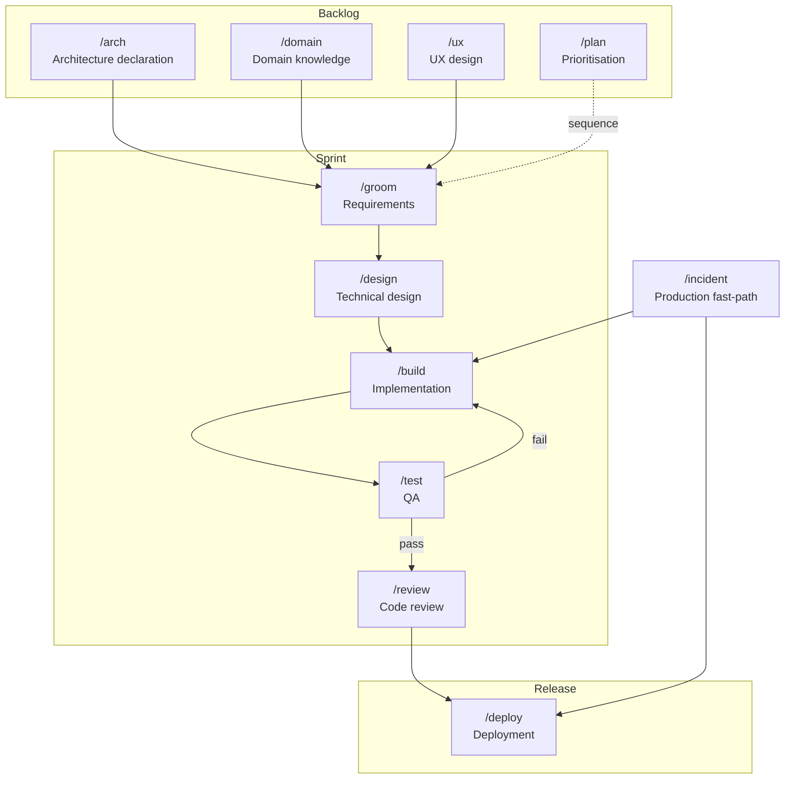

# pai-orbit

A structured developer methodology harness, distributed as a Claude Code plugin and as rule/instruction bundles for Cursor, GitHub Copilot, and OpenAI Codex.

pai-orbit gives your project a shared vocabulary for how work gets done — distinct modes for building, designing, planning, and exploring data; operational skills for git, task management, and deployment; and a first-time setup that generates everything project-specific from a short conversation.

> **This repository is a Claude Code marketplace.** The pai-orbit plugin lives at [`plugins/pai-orbit/`](plugins/pai-orbit/). The marketplace currently lists this one plugin; additional plugins can be added alongside it.

## What it is

Software teams waste context constantly: half-designed features get built, build sessions derail into planning debates, agronomic (or domain) questions get answered with guesses. pai-orbit imposes a light discipline: **each slash command puts Claude into a distinct headspace with a defined output destination.** Switching is explicit. Outputs are saved. Nothing important lives only in a conversation.

```
Backlog
/arch            → architecture declaration — produces docs/architecture/ (system, constraints, stack)
/domain          → domain knowledge — produces docs/domain/
/ux              → user flow and layout design — produces docs/features/*/ux.md

Sprint
/groom           → feature requirements — produces docs/features/*/requirements.md
/design          → technical trade-offs — produces docs/decisions/ and docs/features/*/design.md
/build           → implementation — reads docs and constraints, checks task board, ships
/test            → test planning and QA pass — produces docs/features/*/test-plan.md
/review          → code review — checks diff against constraints, CLAUDE.md, ADRs, requirements

Release
/deploy          → guided deployment with preflight and post-deploy verification

Production fast-path
/incident        → triage → BUILD → REVIEW → DEPLOY → post-mortem

Workflow skills
/git             → commit, branch, PR — reads project branching model
/board           → task creation, card movement, team assignment
/analysis        → change impact and dependency analysis
/data-model      → schema reference and migration management
/security-review → OWASP-based security pass on changed code
/simplify        → code simplification — remove over-engineering, dead code, abstractions

Planning and maintenance
/plan            → roadmap and prioritisation — consumes docs, moves board cards
/data            → data exploration — produces docs/reports/
/epic            → epic lifecycle — create, load, update, and list epics in docs/epics/
/setup           → first-time configuration — generates config, agents, hooks, docs scaffold
/suggest-skills  → discover recurring patterns worth encoding as project skills
```

## Mode flow



Workflow skills (`/git`, `/board`, `/analysis`, `/data-model`, `/security-review`, `/simplify`) can be invoked from any phase.

## Install

### Claude Code (full fidelity)

```bash
# Add the marketplace straight from GitHub
/plugin marketplace add the-psi/pai-orbit

# Install the plugin
/plugin install pai-orbit@pai-orbit
```

That's it — Claude Code fetches the repo and resolves the plugin from the marketplace listing. The listing points at `plugins/pai-orbit/dist/claude-code/`, which is the committed, built artifact produced by `plugins/pai-orbit/adapters/claude-code/build.sh`. No clone needed for installation.

If you're developing against a local checkout instead:

```bash
git clone https://github.com/the-psi/pai-orbit
/plugin marketplace add /absolute/path/to/pai-orbit
/plugin install pai-orbit@pai-orbit
```

### Other coding assistants (lossy)

The same plugin source is compiled to per-tool bundles under `plugins/pai-orbit/dist/`. These bundles are **lossy** — modes become always-on rule documents, and there is no command, skill, agent, or hook system in these tools.

| Tool | Path | How to install |
|------|------|----------------|
| Cursor | [`plugins/pai-orbit/dist/cursor/`](plugins/pai-orbit/dist/cursor/) | Copy `.cursor/` into your project root |
| GitHub Copilot | [`plugins/pai-orbit/dist/copilot/`](plugins/pai-orbit/dist/copilot/) | Copy `.github/copilot-instructions.md` into your project |
| OpenAI Codex CLI (experimental) | [`plugins/pai-orbit/dist/codex/`](plugins/pai-orbit/dist/codex/) | Copy `AGENTS.md` to your project root |

See [`plugins/pai-orbit/README.md`](plugins/pai-orbit/README.md) for adapter internals and how to rebuild the bundles.

## First run

After installing, run `/setup` in your project directory. It will:

1. Discover your repo structure and tech stack
2. Ask a short set of questions (task board, branching model, deployment, docs home, team, architecture)
3. Generate `.claude/pai-orbit-config.md`, `.claude/team.md`, a `CLAUDE.md` stub, stack-specific agents, a `docs/` scaffold, and a `docs/architecture/` stub
4. Tell you exactly what to fill in by hand

Then run `/arch init` to complete your architecture declaration — a guided interview that writes `docs/architecture/system.md` (service map), `constraints.md` (enforcement rules), and `stack.md`. Once declared, `/build` reads the constraints before generating code and `/review` checks every diff against them.

Re-run `/setup` anytime the stack or team changes significantly.

## Agents

Two built-in agents ship with pai-orbit; `/setup` generates additional stack-specific agents for your project.

| Agent | Role |
|-------|------|
| `docs-writer` | Writes and updates docs locally; syncs outbound to Confluence/Notion via MCP |
| `cross-repo-impact` | Read-only — searches configured repos for usages of a changed interface and classifies each as breaking, compatible, or unknown |
| Stack agents | One agent per service (FastAPI, Next.js, Django, Express, React/Vite, IaC, generic), generated by `/setup`. Each works only inside its service directory and runs tests before claiming completion. |

## Hooks

Four shell hooks are included. Wire them in Claude Code's settings or copy them to `.claude/hooks/` in your project (done automatically by `/setup`).

| Hook | Event | What it does |
|------|-------|--------------|
| `bash-guard.sh` | PreToolUse | Blocks `git push --force`, bulk staging (`git add .`/`-A`), `--no-verify`, and unsafe `rm` on root/home |
| `lint-python.sh` | PostToolUse | Runs `ruff check` after any `.py` edit. Advisory — never blocks. |
| `lint-ts.sh` | PostToolUse | Runs `eslint --max-warnings 0` after any `.ts`/`.tsx` edit. Advisory — never blocks. |
| `arch-drift-guard.sh` | PostToolUse | Prints an advisory nudge when structural files (`docker-compose.yml`, `package.json`, `go.mod`, etc.) are edited. Suggests `/arch validate`. Never blocks. |

## Docs

- [Process & Practices](docs/process-and-practices.md) — the methodology: why modes, working style, how sessions should flow
- [Capabilities](docs/capabilities.md) — reference for every mode, skill, and agent
- [Getting Started](docs/getting-started.md) — installation, first `/setup` walkthrough, first session

## Philosophy

**Producer/consumer.** `/arch` produces the architecture contract. `/domain` produces science. `/groom` produces requirements. `/design` produces feature-level architecture. `/build` produces code. `/plan` consumes all of the above to decide what to work on next. Switch modes when the headspace or output destination changes.

**Local-first docs.** All modes write markdown locally. If your team uses Confluence or Notion, `docs-writer` handles outbound sync. Local is Claude's working copy; the remote platform is the published surface. Edits should flow outward, not inward — bidirectional sync creates conflicts that are hard to resolve cleanly.

**Config over baked-in.** Modes contain methodology, not project specifics. Board URLs, branch naming conventions, deployment targets, and team handles all live in `.claude/pai-orbit-config.md` and `.claude/team.md`. `/setup` generates those; the modes read them.

## License

MIT
