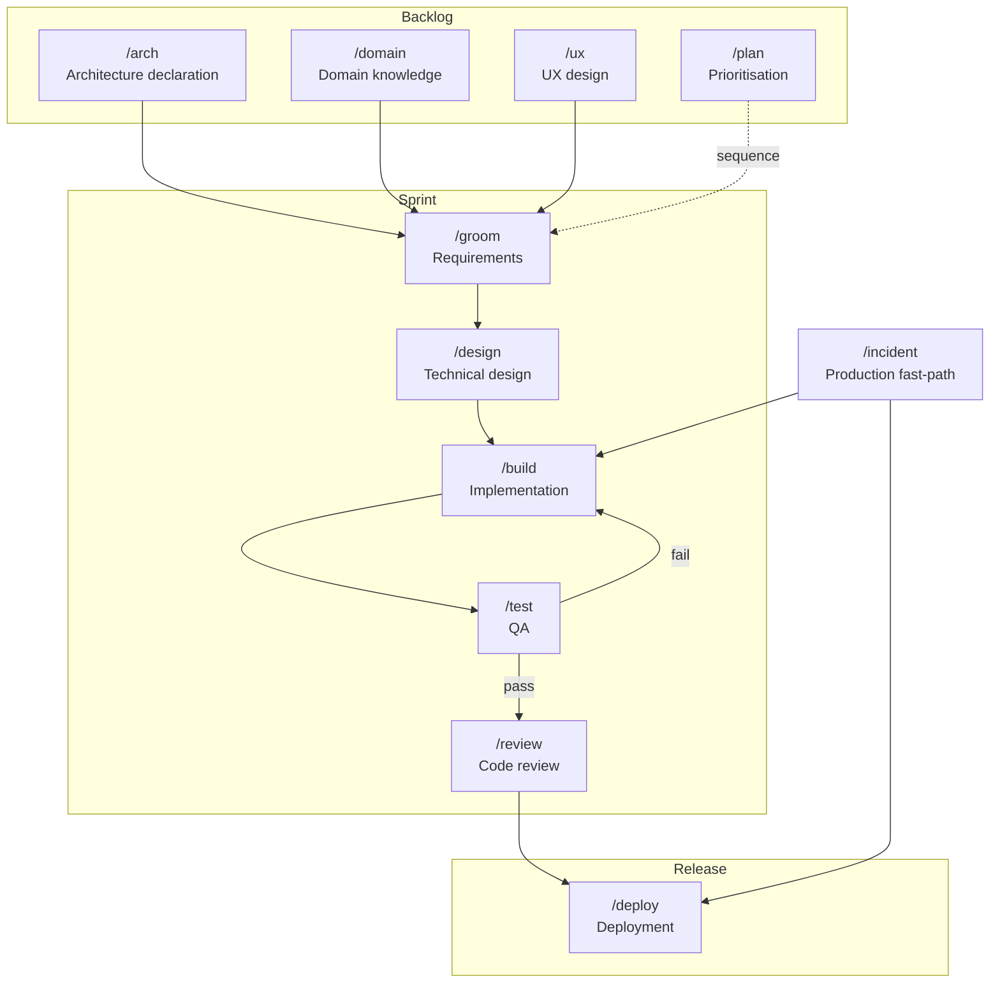

# PAI-Orbit

A structured developer methodology harness for Claude Code, Cursor, and Codex CLI.

PAI-Orbit gives your project a shared vocabulary for how work gets done — distinct modes for building, designing, planning, and exploring data; operational skills for git, task management, and deployment; and a first-time setup that generates everything project-specific from a short conversation.

Every mode and skill is defined once in a canonical format and compiled into the native constructs of each tool: slash commands for Claude Code, `.cursor/rules/` for Cursor, and `AGENTS.md` for Codex CLI.

## What it is

Software teams waste context constantly: half-designed features get built, build sessions derail into planning debates, agronomic (or domain) questions get answered with guesses. PAI-Orbit imposes a light discipline: **each slash command puts Claude into a distinct headspace with a defined output destination.** Switching is explicit. Outputs are saved. Nothing important lives only in a conversation.

```
Backlog
/arch            → architecture declaration — produces docs/architecture/ (system, constraints, stack)
/domain          → domain knowledge — produces docs/domain/
/ux              → user flow and layout design — produces docs/features/*/ux.md

Sprint
/groom           → feature requirements — produces docs/features/*/requirements.md
/design          → technical trade-offs — produces docs/decisions/ and docs/features/*/design.md
/build           → implementation — reads docs and constraints, checks task board, ships
/test            → test planning and QA pass — produces docs/features/*/test-plan.md
/review          → code review — checks diff against constraints, CLAUDE.md, ADRs, requirements

Release
/deploy          → guided deployment with preflight and post-deploy verification

Production fast-path
/incident        → triage → BUILD → REVIEW → DEPLOY → post-mortem

Workflow skills
/git             → commit, branch, PR — reads project branching model
/board           → task creation, card movement, team assignment
/analysis        → change impact and dependency analysis
/data-model      → schema reference and migration management
/security-review → OWASP-based security pass on changed code
/simplify        → code simplification — remove over-engineering, dead code, abstractions

Planning and maintenance
/plan            → roadmap and prioritisation — consumes docs, moves board cards
/data            → data exploration — produces docs/reports/
/epic            → epic lifecycle — create, load, update, and list epics in docs/epics/
/setup           → first-time configuration — generates config, agents, hooks, docs scaffold
/suggest-skills  → discover recurring patterns worth encoding as project skills
```

## Mode flow



Workflow skills (`/git`, `/board`, `/analysis`, `/data-model`, `/security-review`, `/simplify`) can be invoked from any phase.

## Cursor & Codex CLI

PAI-Orbit's mode discipline works in Cursor and Codex CLI, not just Claude Code. Each command and skill file carries a canonical YAML front-matter spec. Generator scripts read those specs and produce tool-native output — no hand-maintained parallel files.

### Cursor

Generate one `.mdc` rule per mode and skill into `.cursor/rules/`:

```bash
# After first-time setup (scripts copied to .claude/scripts/)
.claude/scripts/generate-cursor.sh

# Or directly from the plugin
~/.claude/plugins/pai-orbit/scripts/generate-cursor.sh --output-dir .
```

22 rules are generated:

| Rule type | Examples |
|-----------|---------|
| `agent_requested` | All mode rules (`build`, `design`, `plan`…) and most skills — Cursor attaches them when the task matches |
| `auto_attached` | `data-model` → attaches on `*.sql`, `migrations/**`; `test` → attaches on `*_test.*`, `*.spec.*` |
| `alwaysApply: true` | `bash-guard` — safety rules (no force-push, no bulk staging) active at all times |

To enter a mode in Cursor: type "enter build mode" or start a task — the agent attaches the relevant rule automatically. A `.vscode/tasks.json` lint template is also generated when Python or TypeScript is detected.

### Codex CLI

Generate `AGENTS.md` (all modes and skills in a single file) and install the `pai` CLI wrapper:

```bash
# Generate AGENTS.md
~/.claude/plugins/pai-orbit/scripts/generate-codex.sh --output-dir .

# Install the pai wrapper
cp ~/.claude/plugins/pai-orbit/scripts/pai ~/.local/bin/pai
```

Use modes and skills from the terminal:

```bash
pai build "implement user login with JWT"
pai design "how should we structure the notifications service"
pai review
pai git "commit and push"
pai deploy
```

Or invoke Codex directly: `codex "Enter BUILD MODE. implement user login"`

The `pai` wrapper prepends the right mode/skill context so you don't have to type it each time.

### Regenerating after updates

When PAI-Orbit is updated or you edit a command or skill file, regenerate:

```bash
.claude/scripts/generate-cursor.sh   # → .cursor/rules/
.claude/scripts/generate-codex.sh    # → AGENTS.md
```

`/setup` runs these automatically and copies the scripts to `.claude/scripts/` the first time.

---

## Install

```bash
# From the pratham-software marketplace
/plugin marketplace add pratham-software/PAI-Orbit
/plugin install PAI-Orbit@pratham-software
```

```bash
# Clone into a local plugins directory
git clone https://github.com/the-psi/pai-orbit ~/.claude/plugins/pai-orbit

# Symlink the plugin into a target project
ln -s ~/.claude/plugins/pai-orbit/.claude-plugin .claude/plugins/pai-orbit

# Reload plugins in Claude Code
/reload-plugins
```

## First run

After installing, run `/setup` in your project directory. It will:

1. Discover your repo structure and tech stack
2. Ask a short set of questions (task board, branching model, deployment, docs home, team, architecture, and **which AI tools your team uses**)
3. Generate `.claude/pai-orbit-config.md`, `.claude/team.md`, a `CLAUDE.md` stub, stack-specific agents, a `docs/` scaffold, and a `docs/architecture/` stub
4. If Cursor or Codex CLI was selected: run the adapter generators and copy them to `.claude/scripts/` for future use
5. Tell you exactly what to fill in by hand

Then run `/arch init` to complete your architecture declaration — a guided interview that writes `docs/architecture/system.md` (service map), `constraints.md` (enforcement rules), and `stack.md`. Once declared, `/build` reads the constraints before generating code and `/review` checks every diff against them.

Re-run `/setup` anytime the stack or team changes significantly.

## Agents

Two built-in agents ship with PAI-Orbit; `/setup` generates additional stack-specific agents for your project.

| Agent | Role |
|-------|------|
| `docs-writer` | Writes and updates docs locally; syncs outbound to Confluence/Notion via MCP |
| `cross-repo-impact` | Read-only — searches configured repos for usages of a changed interface and classifies each as breaking, compatible, or unknown |
| Stack agents | One agent per service (FastAPI, Next.js, Django, Express, React/Vite, IaC, generic), generated by `/setup`. Each works only inside its service directory and runs tests before claiming completion. |

## Hooks

Four shell hooks are included. Wire them in Claude Code's settings or copy them to `.claude/hooks/` in your project (done automatically by `/setup`).

| Hook | Event | What it does |
|------|-------|--------------|
| `bash-guard.sh` | PreToolUse | Blocks `git push --force`, bulk staging (`git add .`/`-A`), `--no-verify`, and unsafe `rm` on root/home |
| `lint-python.sh` | PostToolUse | Runs `ruff check` after any `.py` edit. Advisory — never blocks. |
| `lint-ts.sh` | PostToolUse | Runs `eslint --max-warnings 0` after any `.ts`/`.tsx` edit. Advisory — never blocks. |
| `arch-drift-guard.sh` | PostToolUse | Prints an advisory nudge when structural files (`docker-compose.yml`, `package.json`, `go.mod`, etc.) are edited. Suggests `/arch validate`. Never blocks. |

## Docs

- [Process & Practices](docs/process-and-practices.md) — the methodology: why modes, working style, how sessions should flow
- [Capabilities](docs/capabilities.md) — reference for every mode, skill, and agent
- [Getting Started](docs/getting-started.md) — installation, first `/setup` walkthrough, first session

## Philosophy

**Producer/consumer.** `/arch` produces the architecture contract. `/domain` produces science. `/groom` produces requirements. `/design` produces feature-level architecture. `/build` produces code. `/plan` consumes all of the above to decide what to work on next. Switch modes when the headspace or output destination changes.

**Local-first docs.** All modes write markdown locally. If your team uses Confluence or Notion, `docs-writer` handles outbound sync. Local is Claude's working copy; the remote platform is the published surface. Edits should flow outward, not inward — bidirectional sync creates conflicts that are hard to resolve cleanly.

**Config over baked-in.** Modes contain methodology, not project specifics. Board URLs, branch naming conventions, deployment targets, and team handles all live in `.claude/pai-orbit-config.md` and `.claude/team.md`. `/setup` generates those; the modes read them.

## License

MIT
