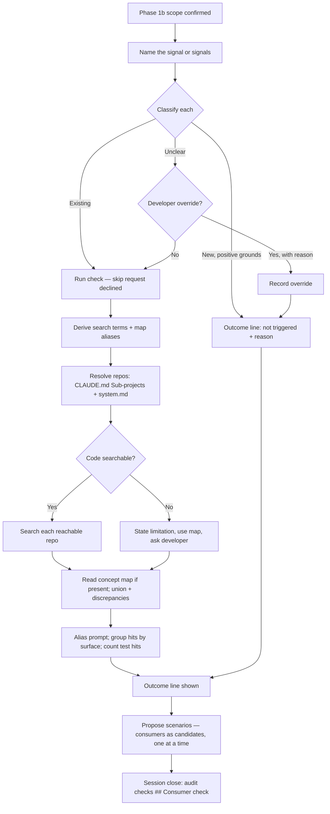

# Design: `/groom` consumer check for existing signals

**Date:** 2026-09-29
**Issue:** [#37](https://github.com/the-psi/pai-orbit/issues/37)
**Requirements:** [requirements.md](./requirements.md) (status: Groomed — ready for /design) — 21 REQs, 13 ACs, 10 scenarios
**Branch:** `feat/groom-shared-signal-consumers`
**ADR:** [2026-09-29-groom-consumer-check-conventions](../../decisions/2026-09-29-groom-consumer-check-conventions.md)
**Status:** Designed — ready for /build

---

## Inputs read

- `requirements.md` for this feature, including all 8 deferred design questions
- `plugins/pai-orbit/core/modes/groom.md` (215 lines) — Phase 2, Behaviour, Session close, Output format
- `plugins/pai-orbit/core/skills/analysis/SKILL.md`, `core/agents/cross-repo-impact.md`
- `plugins/pai-orbit/core/reference/docs-path-resolution.md` and how each adapter ships `reference/`
- `plugins/pai-orbit/core/templates/CLAUDE.md.template` (Sub-projects table), `pai-orbit-config.md.template` (`## System Docs`)
- Every adapter's `build.sh` for `CLAUDE.md` → `AGENTS.md` rewrites, and every adapter's built `groom` output
- `docs/architecture/constraints.md` (rules 1, 4, 6, 7), `docs/epics/multi-repo-docs/EPIC.md`
- `docs/features/groom-product-context/design.md` and `test-plan.md` (prior groom change, for method)

## Impact-analysis gate

**No shared interface changes detected — `/analysis` skipped.** `requirements.md` is consumed by
`/design`, `/test`, `/review`, `/epic` and `/board`; all read it by existing headings or the status
line. A new `## Consumer check` section and a new pre-flight check are additive. One intended
side effect: re-grooming a feature whose older `requirements.md` has no consumer-check record will
fail the audit until the record is added (REQ-21 working as designed).

**Parity check:** all 5 adapters' built groom output currently carries Phase 2, the pre-flight
audit and the output format. (The note in `groom-product-context/design.md` that copilot and codex
drop `## Session flow` is no longer true.) Anything added inline to `groom.md` therefore reaches
every adapter through a normal rebuild.

## Problem restated

Groom confirms scenarios from the surface the issue names. When the change alters how an
**existing** signal is read, other readers of that signal carry the same bug, and nothing in groom
today makes anyone look for them. The fix is a Phase 2 step that finds them, turns each into a
candidate scenario, and leaves a record the session-close audit can check. The bar is "never
silently skipped", so the design favours visibility and enforceability over brevity.

---

## Decisions

### D1 — The procedure lives inline in `groom.md` Phase 2

| Option | Verdict |
|---|---|
| **A. Inline in `groom.md` Phase 2** | **Chosen** |
| B. New `core/reference/consumer-check.md` | Rejected — codex and copilot inline references by hardcoded filename, so both `build.sh` files would change; a pointer to a separate file is also easier for the model to skip |
| C. Delegate to `/analysis` step 2 | Rejected — `/analysis` classifies breakage (rule 4 keeps that out of groom) and writes a `wip/analysis-*` report, the wrong artifact |

No adapter changes. Cost: about 40–60 lines added to `groom.md`.

### D2 — Trigger rule: asymmetric, name the signal first

Groom **names the signal** (field, flag, derived value) before it classifies. Classification:

- **New** — only when the change adds a name that nothing reads today **and** changes no existing
  reading. The positive grounds must be stated in the outcome line.
- **Existing** — anything that changes how an existing name is read, derived, gated, suppressed,
  corrected or replaced. "Add `status` to replace how the dashboard reads `is_active`" is
  **Existing** (for `is_active`).
- **Unclear** — any doubt. Runs the check (REQ-9); only here may the developer override (REQ-10).

Rejected: a verb list (depends on the issue's wording, e.g. "show X only when…" slips past) and a
symmetric definition (no safe default). The named signal is where D3's search terms start.

A change may touch more than one signal; each is classified and recorded separately.

### D3 — Groom searches inline with host tools, using fixed rules

Rejected: the `cross-repo-impact` agent (C, hybrid, or B, all searches). It answers "will this
break?" not "does the fix belong here too?"; the requirements forbid changing it; and it cannot be
called from groom in two adapters — copilot ships it only as a user-run prompt file, and legacy
cursor has no agents. A second search path would also be a second place for a silent gap. The
only thing C improves is chat context size on large multi-repo searches; it can be added later as
an optimisation without changing the record format.

Rules written into groom:

1. **Search terms** — the named signal plus casing variants (`is_active`, `isActive`,
   `IS_ACTIVE`, `is-active`), serialized/API key names, config/env keys, derived names
   (`active_count`, `hasActive`), and aliases from the concept map (D5).
2. **Alias prompt** — after searching, ask once: "Does this signal go by any other name?"
   Answers are searched too.
3. **Candidate = consuming surface** (screen, job, endpoint, component), not a grep line. Phase 2's
   granularity test decides grouping.
4. **Test/fixture hits** are reported as a count, not proposed as scenarios.
5. **Exact search terms are recorded** so "none found" is checkable.
6. The surface the issue already names is not re-proposed.

Hosts without file search (e.g. Copilot ask mode, docs-only repo) take the Scenario 7 path:
state the limitation, use the map if present, ask the developer. Never "none found".

### D4 — Declared repos = project context file Sub-projects table + `system.md` services

Groom merges and de-duplicates:

- the **Sub-projects** table in `CLAUDE.md` (Name | Path | Stack | Purpose) — written by `/setup` in
  every adapter, and already the source `cross-repo-impact` uses; and
- the service list in `<docs root>/architecture/system.md` — in multi-repo setups `<docs root>`
  is the shared docs repo, which lists every service even when the current repo's context file
  lists only itself.

Each repo is reported as **searched** (path resolves locally) or **not reachable** (declared, not
on disk → Scenario 7 handling: named, developer asked). Sibling-folder scanning was rejected as
guessing (REQ-18). Single-repo projects have nothing to merge and behave as before.

**Tool file names:** `core/` says `CLAUDE.md`. The cursor-plugin, copilot and codex adapters
already rewrite the standalone token `CLAUDE.md` → `AGENTS.md` (copilot falls back to
`CLAUDE.md` for legacy installs); legacy cursor keeps `CLAUDE.md`. No adapter uses `AGENT.md`.
The new text must use the plain token `CLAUDE.md` (not inside a longer filename) so the rewrite
catches it — verified in build task 7.

### D5 — Concept map: one fixed file, one table

`<docs root>/domain/concept-consumers.md`, containing a markdown table, one row per consumer:

```markdown
| Concept | Aliases | Consumer | Repo |
|---|---|---|---|
| `is_active` | Enabled, active flag | Dashboard user list | web |
| `is_active` | | Weekly email report | jobs |
```

- Same pattern as `domain/product-capabilities.md`: fixed name, read if present, never created.
- **Aliases** feed D3's search terms.
- One row per consumer makes the map-vs-code diff (Scenario 6) direct. `Repo` may be blank in
  single-repo projects.
- File present but table unreadable → "concept map found but not in the expected format"; continue
  with the code search. An unreadable map is never treated as "no consumers".
- Groom never edits it (REQ-14). No `/setup` template (out of scope); the format is documented in
  `groom.md` and `docs/capabilities.md`.

Rejected: one file per concept (groom must guess file names — a silent-miss path) and "any
consumers table in `domain/`" (makes "map found?" fuzzy).

⚠️ **Hard to reverse:** once teams create this file, renaming it or changing its columns breaks
them silently. Recorded in the ADR.

### D6 — Record: a new `## Consumer check` section after `## Scenarios in scope`

Fixed labelled lines, one block per signal:

```markdown
## Consumer check
- Signal: `is_active`
- Classification: Existing — the issue changes how the dashboard reads it
- Override: none
- Search terms: is_active, isActive, IS_ACTIVE, active_count, "Enabled"
- Repos searched: web, jobs · Not reachable: mobile (developer asked — see Context)
- Concept map: <docs root>/domain/concept-consumers.md
- Consumers found:
  - Weekly email report (jobs) → In scope, Scenario 3
  - Export button (web) → Excluded, see Out of scope
- Test-only hits: 4 files
- Map discrepancies: map lists "Admin panel" (not found in code) — suggest map update
```

A not-triggered block is three lines: `Signal`, `Classification: New — <grounds>`, `Override: none`.
Excluded-consumer reasons stay in `## Out of scope` (REQ-5) and search limitations in `## Context`
(REQ-16); this section links to them rather than repeating them. Rejected: prose in `## Context`
(can't be checked for completeness) and notes on `## Scenarios in scope` (nowhere to record "not
triggered").

⚠️ **Hard to reverse:** the heading and labels are what the audit checks; renaming them later means
old files fail the audit. Recorded in the ADR.

### D7 — Reliability: order gate + fixed line + examples + audit

1. **Order gate** — "Do not present Scenario 1 until the consumer-check line has been shown."
2. **Fixed on-screen line**, every session:
   `🔎 Consumer check — Signal: <name> · <Existing|New|Unclear> (<reason>) · Searched: <code repos | map path | none + limitation> · Result: <N other consumers | none found | not triggered>`
3. **Three one-line examples**, alongside groom's existing Chrome/Firefox pattern:
   - ✅ Triggered — "Hide inactive users on the dashboard" (changes how `is_active` is read)
   - ❌ Not triggered — "Add a `nickname` field to the profile" (new; nothing reads it)
   - ⚠️ Triggered — "Add `status` to replace `is_active` on the dashboard" (changes an existing reading)
4. **Session-close audit** (REQ-21) — a new pre-flight bullet.

Markdown only; no XML-style tags (inconsistent with every mode file and every adapter).

### D8 — Testing: fixture project with known answers, run in two tools

Same method as #35 (install built groom as a throwaway command, run real sessions), against a
scratchpad fixture:

- `is_active` read in 3 surfaces — 2 in `web/`, 1 in `jobs/` — plus 2 test files
- `docs/domain/concept-consumers.md` with one stale row (a surface no longer in code)
- `CLAUDE.md` Sub-projects listing `web`, `jobs`, `mobile`; `mobile/` absent

| Run | Covers |
|---|---|
| "Hide inactive users on the dashboard" | S1, S5, S6, S8 — AC-1, AC-3, AC-7, AC-8, AC-10 |
| "Add a nickname field" | S3 — AC-5 |
| Ambiguous change, then developer override | S4 — AC-6 |
| Same issue from a docs-only folder | S7 — AC-9 |
| Ask to skip the search; strip the record before close | AC-2, S10 — AC-12 |
| Only-surface fixture variant | S2 — AC-4 |
| `constraints.md` present / absent | S9 — AC-11 |

Plus a text check of all 5 `dist/` groom outputs (AC-13), and S1 + S3 re-run in Copilot or Codex
(rule 6). Detailed cases are written by `/test` into `test-plan.md`. Rejected: Claude Code only
(weaker parity evidence) and an automated harness (belongs to the `test-automation` epic).

---

## Designed Phase 2 flow



## Requirement coverage

| REQ | Where satisfied |
|---|---|
| REQ-1, 8, 9, 10 | D2 trigger rule + D7 examples |
| REQ-2, 7 | D3 search rules |
| REQ-3, 5 | Candidates enter existing Phase 2 one-at-a-time confirmation; exclusions → `## Out of scope` |
| REQ-4 | Flow: skip request declined when classification is Existing |
| REQ-6, 12 | D7 fixed outcome line |
| REQ-11, 13, 14 | D5 concept map |
| REQ-15, 16 | D3 unsearchable path; limitation → `## Context` |
| REQ-17, 18 | D4 declared repos |
| REQ-19 | Build task 1 |
| REQ-20 | D6 section |
| REQ-21 | D7 item 4, build task 3 |

---

## Build tasks

1. `core/modes/groom.md` `## Behaviour` — add "If `<docs root>/architecture/constraints.md` exists,
   read it at session start and apply its rules to scope and scenarios; absent is not an error"
   next to the existing `system.md` bullet (REQ-19).
2. `core/modes/groom.md` Phase 2 — insert a new step 1 **Consumer check** (renumber existing steps
   1–7 → 2–8; nothing references Phase 2 step numbers). Contents: order gate, D2 rule + D7 examples,
   D4 repo resolution, D3 search rules, D5 map read + format + unreadable handling, union and
   discrepancies, unsearchable path, alias prompt, D7 outcome line, "completeness, not breakage"
   note (rule 4).
3. `core/modes/groom.md` Session close step 0 — new bullet: `## Consumer check` must exist with
   every required label for each signal (3 labels when New); otherwise
   "❌ Returning to Phase 2. Consumer-check outcome not recorded."
4. `core/modes/groom.md` `## Output format` — add the `## Consumer check` template (D6) after
   `## Scenarios in scope`.
5. `docs/capabilities.md` — extend the `/groom` paragraph; document the concept map path and
   columns.
6. Version bump 1.8.0 → 1.9.0: `core/plugin.json`, `package.json`, `README.md` (title + a short
   release note), `CLAUDE.md`.
7. `bash plugins/pai-orbit/build.sh`; verify every adapter's built groom contains the consumer
   check, the audit bullet and the section template; verify cursor-plugin, copilot and codex
   output says `AGENTS.md` in the new lines.
8. `/test` — write `test-plan.md` per D8 and run it.

## Risks

- **Model still skips the step.** Mitigated by the order gate, the visible line and the audit.
  Not eliminated — a prompt cannot guarantee it (requirements `## Context`).
- **Noisy results on common names** (`status`, `type`). Grouping by surface limits it; the
  developer can exclude with a reason. Watch in testing.
- **`system.md` without paths.** Services named without a locally resolvable path show as not
  reachable, which adds questions to the session. Correct behaviour, but a cost.
- **Length.** About 60 lines added to a 215-line mode. Keep every rule to one line.

## Open questions

None blocking. All 8 design questions from grooming are resolved (D1–D8).

- [ ] Whether to later add the `cross-repo-impact` agent as a context-saving optimisation for
  large multi-repo searches — owner: Chetan Sharma; blocks nothing; revisit after real use.

## Not designed here

- A `/setup` scaffold for `concept-consumers.md` (out of scope per requirements).
- Any change to `/design`'s impact gate, `/analysis`, or `cross-repo-impact`.
