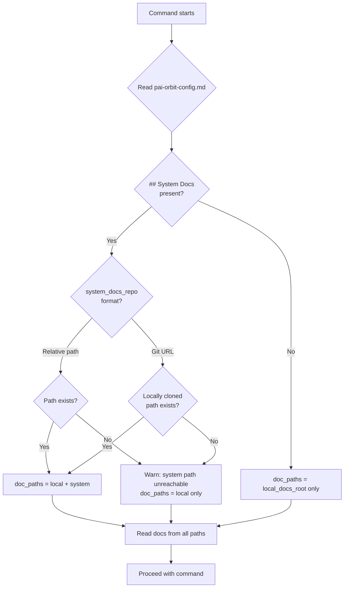

# Design: Multi-Repo Docs Config

**Feature:** multi-repo-docs-config  
**Epic:** docs/epics/multi-repo-docs/  
**Status:** Approved  
**Date:** 2026-05-12  

---

## Problem

pai-orbit's `pai-orbit-config.md` has a `## Docs` section structured around a single docs home (local, dedicated-repo, Confluence, or Notion). In multi-repo microservices projects, a project needs *both* local service docs and a pointer to a system-level docs repo. There is no current mechanism to express this.

---

## Decision 1 — Config Schema: How to Extend `## Docs`

### Options Considered

**Option A — Extend in place**  
Add `system_docs_repo` and `system_docs_path` fields directly inside the existing `## Docs` section.

```markdown
## Docs
Home: local
Path: ./docs

# Multi-repo (optional — omit for single-repo projects)
system_docs_repo: ../project-system
system_docs_path: ./docs
```

- `+` Minimal change, backward-compatible
- `+` Everything doc-related in one section
- `–` `Home: local` + `system_docs_repo` is semantically awkward — local *and* a system repo

**Option B — New `## System Docs` section (chosen)**  
Keep `## Docs` unchanged; add a separate optional `## System Docs` section.

```markdown
## Docs
Home: local
Path: ./docs

## System Docs
# Optional — omit this section entirely for single-repo projects
system_docs_repo: ../project-system
system_docs_path: ./docs
```

- `+` Clean separation — `## Docs` is always single-repo, `## System Docs` is always the cross-repo pointer
- `+` Commands can check "does `## System Docs` exist?" as a single unambiguous condition
- `+` Fully backward-compatible — existing configs have no `## System Docs` block
- `–` Two sections for what feels like one concern

**Option C — Restructure with explicit named fields**  
Replace the `Home:` discriminator with explicit `local_docs_root` and optional `system_docs_repo` fields.

- `+` Most explicit and self-documenting
- `–` Breaking change — removes `Home:` field used by existing configs
- `–` Loses Confluence/Notion home options without re-adding them separately

### Decision: Option B

Cleanest signal for commands (`## System Docs` present = multi-repo project), fully backward-compatible, and does not conflate local and external docs into one block.

---

## Decision 2 — Command Resolution: How Commands Read from Both Paths

### Options Considered

**Option A — Each command reads config independently (chosen)**  
Each command's `.md` preamble includes an instruction block to check for `## System Docs` and resolve the path.

- `+` Self-contained — each command is explicit about what it reads
- `+` No new shared machinery; pure markdown instructions
- `–` Same instruction block duplicated across 5 command files — divergence risk

**Option B — Shared preamble file**  
Extract resolution logic into `commands/_doc-resolution.md`.

- `+` Single source of truth
- `–` Claude Code has no native `include` mechanism — the shared file must still be read manually by each command, putting the burden back on each command definition

**Option C — Inline with visual marker**  
Same as Option A but with a `<!-- DOC RESOLUTION -->...<!-- /DOC RESOLUTION -->` fence to make sync auditable.

- `+` Easy to audit across files
- `–` Still duplicated; relies on convention

### Decision: Option A

Five command files is a small enough surface that duplication is manageable. If drift becomes a problem, upgrading to Option C markers is low-cost.

---

## Resolved Open Questions

| Question | Decision |
|---|---|
| Should `/setup` validate `system_docs_repo` exists before writing? | **Yes for relative paths** (check directory exists). **No for git URLs** (cannot clone at setup time — write the value as-is). |
| Should git URLs be resolved at setup time or command-run time? | **Command-run time only.** Check if the URL has been cloned to a local path; if not, warn once and continue. Setup must not perform network operations. |

---

## Data Flow



---

## Doc Resolution Instruction Block

The following block is added verbatim to the Behaviour section of each affected command (`plan.md`, `domain.md`, `groom.md`, `design.md`, `build.md`):

```
- Read `.claude/pai-orbit-config.md`. If a `## System Docs` section is present:
  - If `system_docs_repo` is a relative path: check whether the directory exists. If yes, add `<system_docs_repo>/<system_docs_path>` to the doc read set. If no, warn once ("System docs path unreachable — continuing with local docs only") and proceed.
  - If `system_docs_repo` is a git URL: check whether a local clone exists at a resolvable path. If yes, add it. If no, warn once and proceed.
  - Read docs from all resolved paths before starting the session.
```

---

## Files Changed

| File | Change |
|---|---|
| `templates/pai-orbit-config.md.template` | Add `## System Docs` section with `system_docs_repo` and `system_docs_path` fields, behind a comment indicating it is optional and should be omitted for single-repo projects |
| `skills/setup/SKILL.md` | Step 2: add "Is this a multi-repo project?" question. Step 3: conditionally write `## System Docs` block; validate relative paths exist before writing |
| `commands/plan.md` | Add doc resolution instruction block to Behaviour section |
| `commands/domain.md` | Add doc resolution instruction block to Behaviour section |
| `commands/groom.md` | Add doc resolution instruction block to Behaviour section |
| `commands/design.md` | Add doc resolution instruction block to Behaviour section |
| `commands/build.md` | Add doc resolution instruction block to Behaviour section |
| `docs/process-and-practices.md` | Add "Multi-Repo Documentation Convention" section |

No new files. No breaking changes to existing configs.

---

## Open Questions

None — all groom open questions resolved above.
